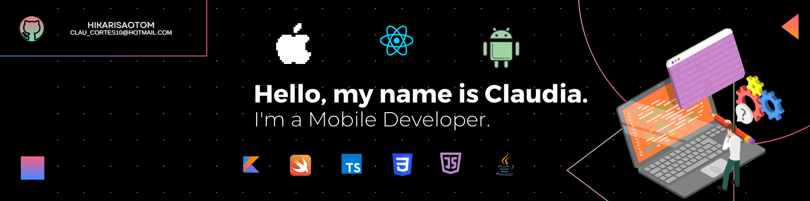

<h1 align="center">Hi, I'm  Claudia Cortés 👋</h1>

## About Me

- 📲 ✨I'm a Mobile developer for Android and iOS✨ , I love what I do 💖!
- 🚘  I have worked on implementing CarPlay and Android Auto in native applications
- 📗 I'm always learning something new, currently I started with Flutter 💻
- 🧑‍🏫 In my free time, I'm also a teacher, I love teaching others how to program.  
 

### ⚙️ &nbsp;GitHub Analytics

### 🛠 &nbsp;Tech Stack

### 🤝🏻 &nbsp;Connect with Me

